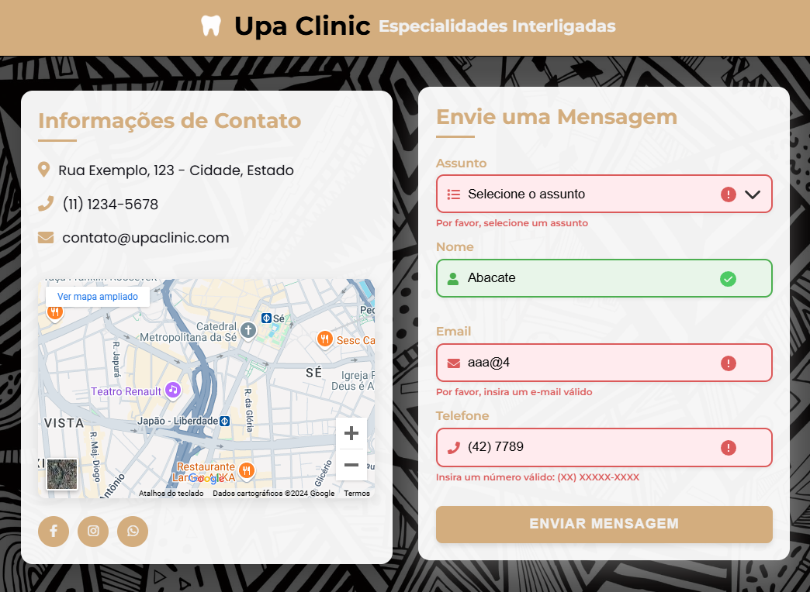
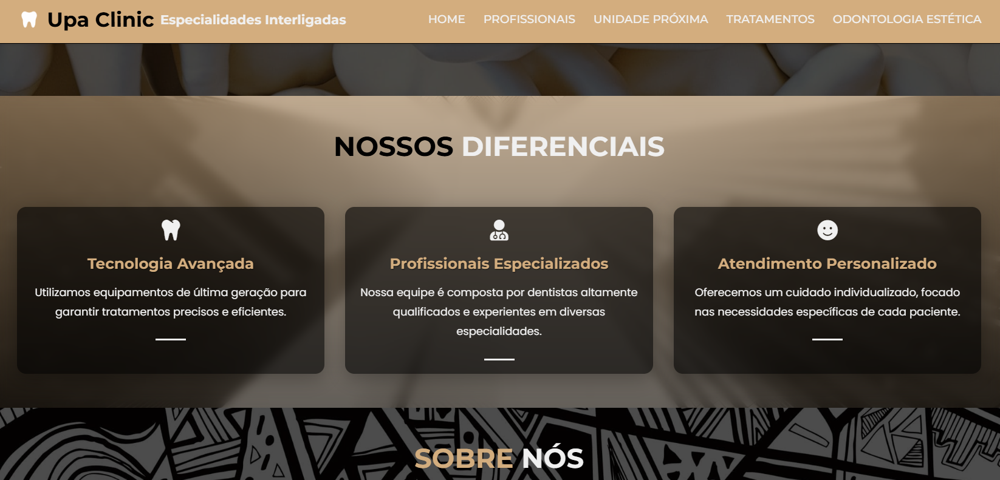
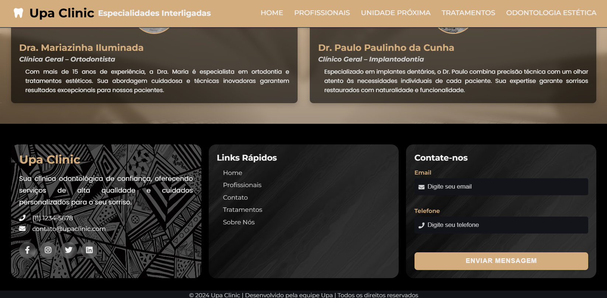
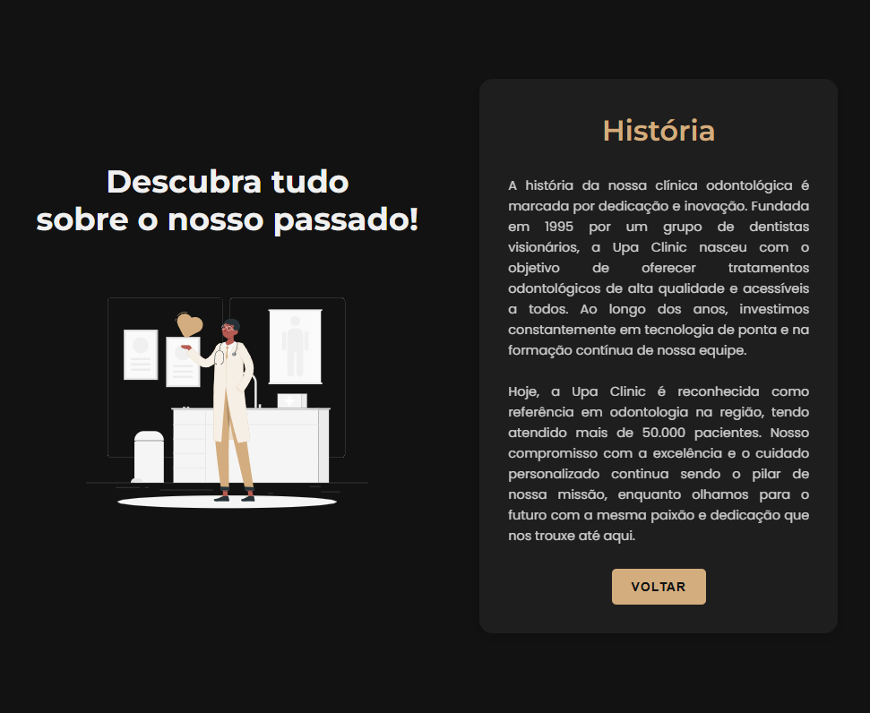
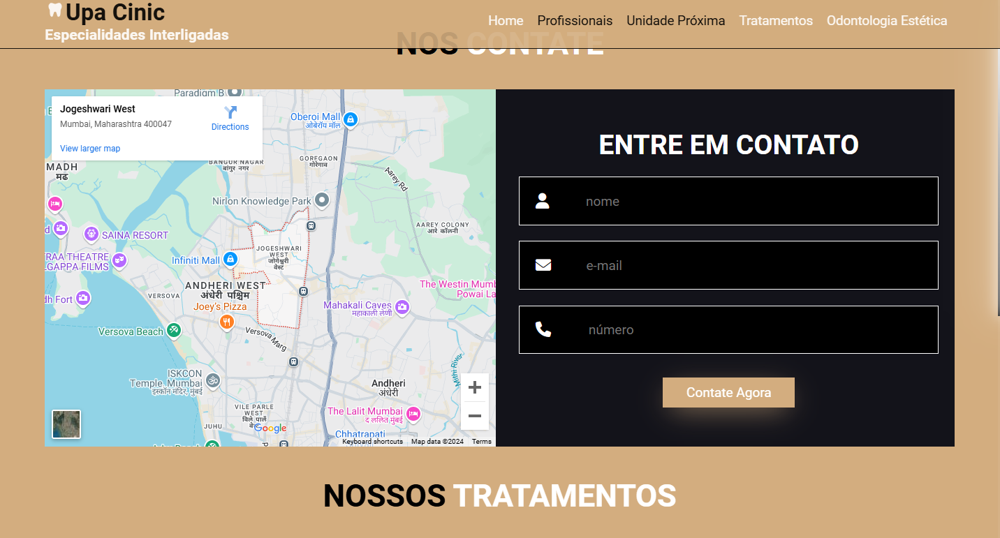
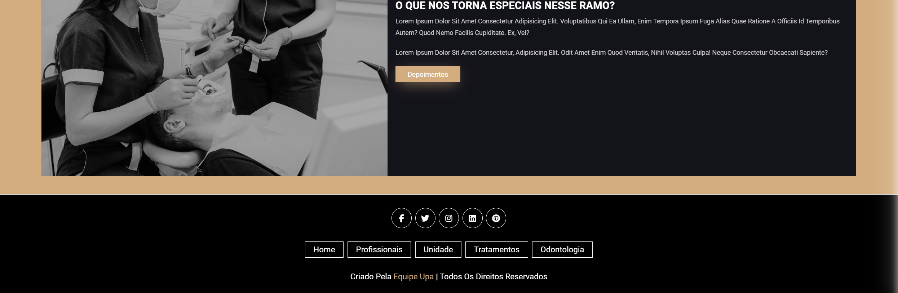
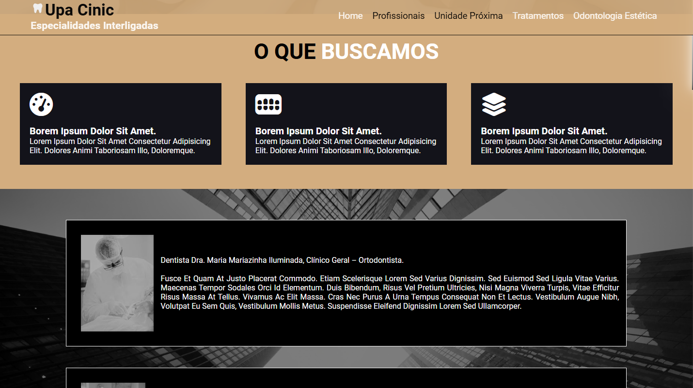

# 🏥 **Upa Clinic**
<p align="center">
  <!-- Contador de linguagens do GitHub -->
  
  <!-- Tamanho do repositório no GitHub -->
  
  <!-- Licença do GitHub -->
  
</p>

<div align="center">
  
</div>

## 📋 **Sobre o Projeto**
Este é um site moderno e responsivo para uma clínica odontológica. Desenvolvido inicialmente durante um curso técnico do **Senac** e atualizado em 2024, o projeto foca em uma experiência de usuário intuitiva, utilizando **HTML**, **CSS** e **JavaScript**.

### 🌟 **Características Principais**
| Funcionalidade                     | Descrição                                                        |
| -----------------------------------| ---------------------------------------------------------------- |
| 🖥️ **Design Responsivo**          | Compatível com dispositivos móveis, tablets e desktops           |
| 📧 **Formulários com Validação**  | Formulários de contato com validação animada                     |
| 🛠️ **Seções Informativas**        | Informações sobre serviços e profissionais da clínica            |
| 🖼️ **Galeria de Imagens**         | Slider de imagens sobre os serviços da clínica                   |

## 🛠️ **Tecnologias Utilizadas**
- [Font Awesome](https://fontawesome.com/) - Biblioteca de ícones vetoriais e logotipos, utilizada para adicionar ícones estilizados ao projeto.
- [Google Fonts](https://fonts.google.com/) - Serviço de fontes da web, usado para incorporar as fontes Montserrat e Poppins.
- [JavaScript](https://developer.mozilla.org/pt-BR/docs/Web/JavaScript) - Para criar interatividade, validar formulários e implementar o slider de imagens.
- [CSS](https://developer.mozilla.org/pt-BR/docs/Web/CSS) - Utilizada para definir o layout, cores e responsividade do site.
- [HTML](https://developer.mozilla.org/pt-BR/docs/Web/HTML) - Usada para estruturar e apresentar o conteúdo do site.

## 🚀 **Como Usar**
1. Clone este repositório:
   ```bash
   git clone https://github.com/devAndreotti/upa-clinic.git
   ```
2. Abra o arquivo `index.html` no seu navegador preferido.

## 📂 **Estrutura do Projeto**
```bash
upa-clinic/
│
├── css/
│   ├── styleMain.css
│   └── styleMinor.css
│
├── js/
│   ├── footer-form.js
│   ├── main-form.js
│   └── slider.js
│
├── img/
│   └── project/
│       ├── design/
│       ├── new/
│       └── old/
│
├── svg/
│   ├── doctor.svg
│   ├── success-icon.svg
│   └── error-icon.svg
│
├── index.html
└── party.html
```

## 🔮 Planos Futuros
- [ ] **Adicionar as fontes usadas no próprio repositório**.
- [ ] **Linkar formulário com banco de dados**.
- [ ] **Arrumar as cores do formulário**.
- [ ] **Adicionar tela de carregamento**.
- [ ] **Arrumar variáveis em root**.
- [ ] **Adicionar menu hamburguer**.
- [ ] **Aprimorar design**.
- [ ] **Padronizar CSS**.

## 💪 Como Contribuir
Contribuições são bem-vindas! Siga estas etapas para colaborar:
1. Faça um fork do projeto.
2. Crie uma nova branch para sua feature: `git checkout -b feature/nome-feature`.
3. Commit suas mudanças: `git commit -m 'Adiciona nova feature'`.
4. Envie para a branch: `git push origin feature/nome-feature`.
5. Abra um Pull Request.

## 🔄 Versão 2.0
<div align="center">
  
  
  
  
  
</div>

## 🔄 Versão 1.0
<div align="center">
  
  
  
</div>

## 📝 Nota
Este projeto começou como uma atividade técnica e foi aprimorado ao longo do tempo. A versão atual reflete um esforço contínuo para melhorar a funcionalidade e a usabilidade da aplicação.

<br>

---
<p align="center"> Desenvolvido por <a href="https://github.com/devAndreotti">Ricardo Andreotti Gonçalves</a> </p>
